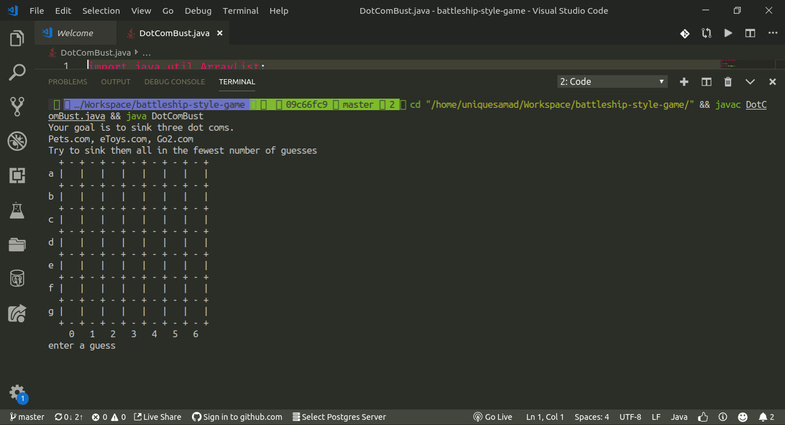
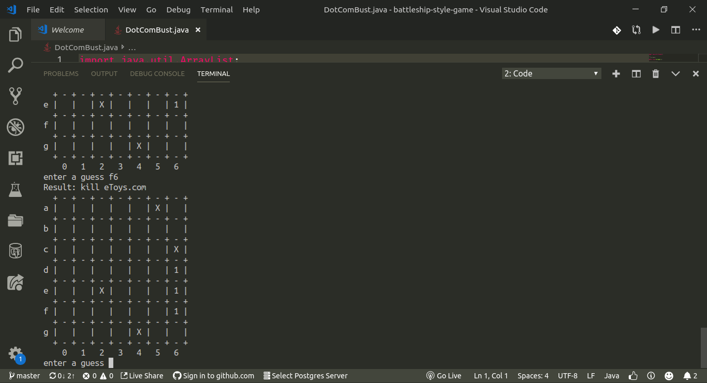
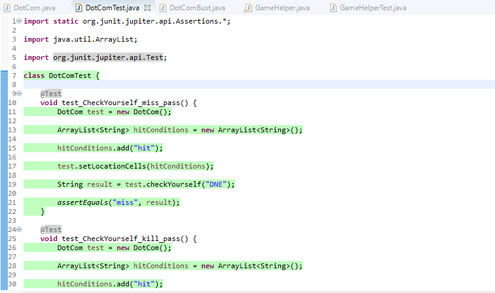
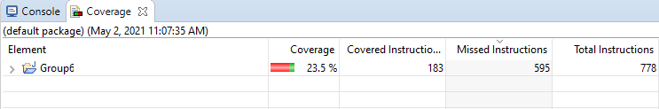

# battleship-style-game
Battlesip Style Game (Sink a DotCom) written in Java

Originally written/coded by Abdul Samad https://github.com/abdsamadf 

Found at repo https://github.com/abdsamadf/battleship-style-game

Cloned and tested by Ryan Barr, Disha Patel and Bailey Thompson

## Get Started

You can download or clone the project, and compile the project then run the DotComBust file in your terminal.

Testing was written in JUnit and should be tested as such. In eclipse right click the Default package and Run as... JUnit test to run tests.

## Demos
### Begin Game Screen

### After Some Moves

### Test cases

### Coverage as of 5/2/21

## Requirement
* [Java](https://java.com/en/download/help/download_options.xml)
